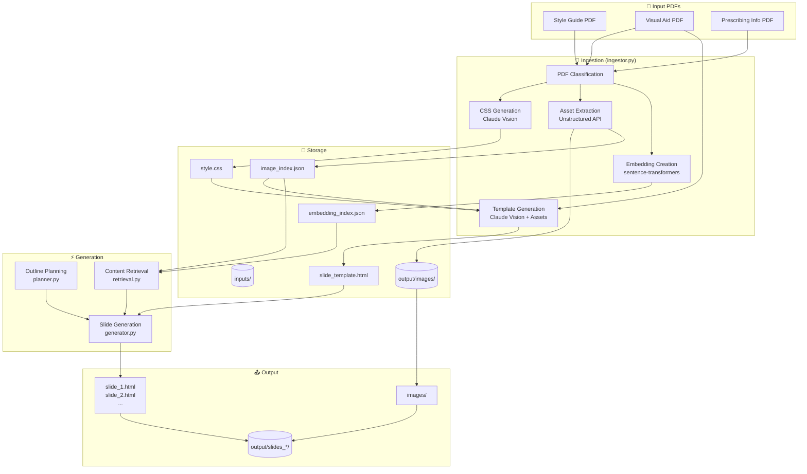
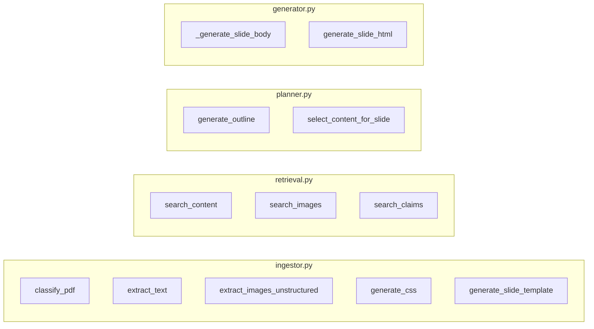

# FRUZAQLA Pipeline - System Architecture

## High-Level Flow



## Component Details



## Data Flow

```
User Prompt
    │
    ▼
┌─────────────────┐
│  planner.py     │ ──► Outline (slides array)
└─────────────────┘
    │
    │  For each slide:
    ▼
┌─────────────────┐
│  retrieval.py   │ ──► PI excerpts + matching images
└─────────────────┘
    │
    ▼
┌─────────────────┐
│  planner.py     │ ──► Selected content for slide
└─────────────────┘
    │
    ▼
┌─────────────────┐     ┌──────────────────────┐
│  generator.py   │ ◄── │ slide_template.html  │
└─────────────────┘     │ previous_slide.html  │
    │                   │ available images     │
    ▼                   └──────────────────────┘
output/slides_YYYYMMDD_HHMM/slide_N.html
```

## File Structure

```
solstice-onsite/
├── fruzaqla_pipeline/
│   ├── app.py              # Streamlit UI
│   ├── config.py           # API keys
│   ├── ingestor.py         # PDF processing
│   ├── retrieval.py        # Semantic search
│   ├── planner.py          # Outline & selection
│   ├── generator.py        # HTML generation
│   └── templates/
│       └── slide.html      # Jinja2 wrapper
├── inputs/
│   ├── *.pdf               # Source PDFs
│   ├── style.css           # Generated CSS
│   ├── slide_template.html # Reference template
│   ├── embedding_index.json
│   └── image_index.json
└── output/
    ├── images/             # Extracted assets
    └── slides_*/           # Timestamped output
        ├── slide_1.html
        ├── slide_2.html
        └── images/         # Copied assets
```
